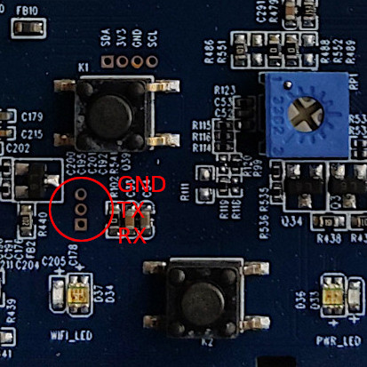

# Installation Guide

Read [`README.md`](README.md) first. It explains the project purpose, supported
firmware versions, build flow and normal flashing path.

This file is the focused installation and recovery checklist.

## 1. Confirm Device Access

Supported WiBox firmware for network-based installation:

```text
V500.R001.A103.00.G0021.B010 or older
```

For newer firmware, prepare serial and use the recovery/U-Boot path.

Default shell credentials when available:

```text
root / qv2008
```

Some Sofia console sessions use:

```text
root / aszeno
```

## 2. Prepare Serial Recovery

Unplug the WiBox before opening the case or attaching serial wires. Do not
solder while the board is powered.

Serial: `115200`, no hardware flow control.

| WiBox board | USB TTL adapter |
|-------------|-----------------|
| GND         | GND             |
| TX          | RX              |
| RX          | TX              |



If no boot messages appear, set the console in U-Boot:

```sh
setenv consoledev 'ttySGK0'
saveenv
reset
```

## 3. Back Up Flash

The build needs the factory `/usr` partition:

```text
./mtd4
```

If SSH works:

```bash
make backup-mtd4
cp backups/mtd4-*.img ./mtd4
```

Manual full backup:

On your computer:

```bash
for i in $(seq 0 6); do
  nc -l -p 8888 > "mtd${i}"
done
```

On the WiBox:

```sh
PC_IP=192.168.1.100
for i in $(seq 0 6); do
  dd if=/dev/mtd${i} bs=4096 | nc "${PC_IP}" 8888
  sleep 1
done
```

## 4. Configure Persistent WiFi

Create `/mnt/mtd/wpa_supplicant.conf`:

```ini
ctrl_interface=/var/run/wpa_supplicant
ap_scan=1

network={
        ssid="YOUR_WIFI_NAME"
        psk="YOUR_WIFI_PASSWORD"
        scan_ssid=1
        key_mgmt=WPA-PSK
}
```

## 5. Build

```bash
make docker
make build
make verify
```

Final image:

```text
release/latest
```

## 6. Test Without Flashing

```bash
make deploy-runtime
make verify-device
```

## 7. Flash Over SSH

```bash
make flash-dry-run
make backup-mtd4
make flash CONFIRM_FLASH=YES
reboot
```

`make flash` runs `backup-mtd4` automatically, but running it explicitly first
makes the backup path visible before writing.

## 8. Recovery Via Shell

Use this when Linux boots and serial shell works.

Transfer `release/latest` to `/tmp/update.img` using your terminal file
transfer support, then run:

```sh
/usr/bin/update_firmware.sh
reboot
```

If the updater is unavailable, manual write is the last resort:

```sh
dd if=/tmp/update.img of=/dev/mtdblock4 bs=4096
sync
```

## 9. Recovery Via U-Boot

Use this when Linux does not boot far enough for a shell.

```sh
mw.b 0xC1000000 ff 00b10000
sf probe
loady 0xC1000000
sf erase 0x00460000 00b10000
sf write 0xC1000000 0x00460000 00b10000
reset
```

Send `release/latest` via YMODEM when `loady` waits for the file.
