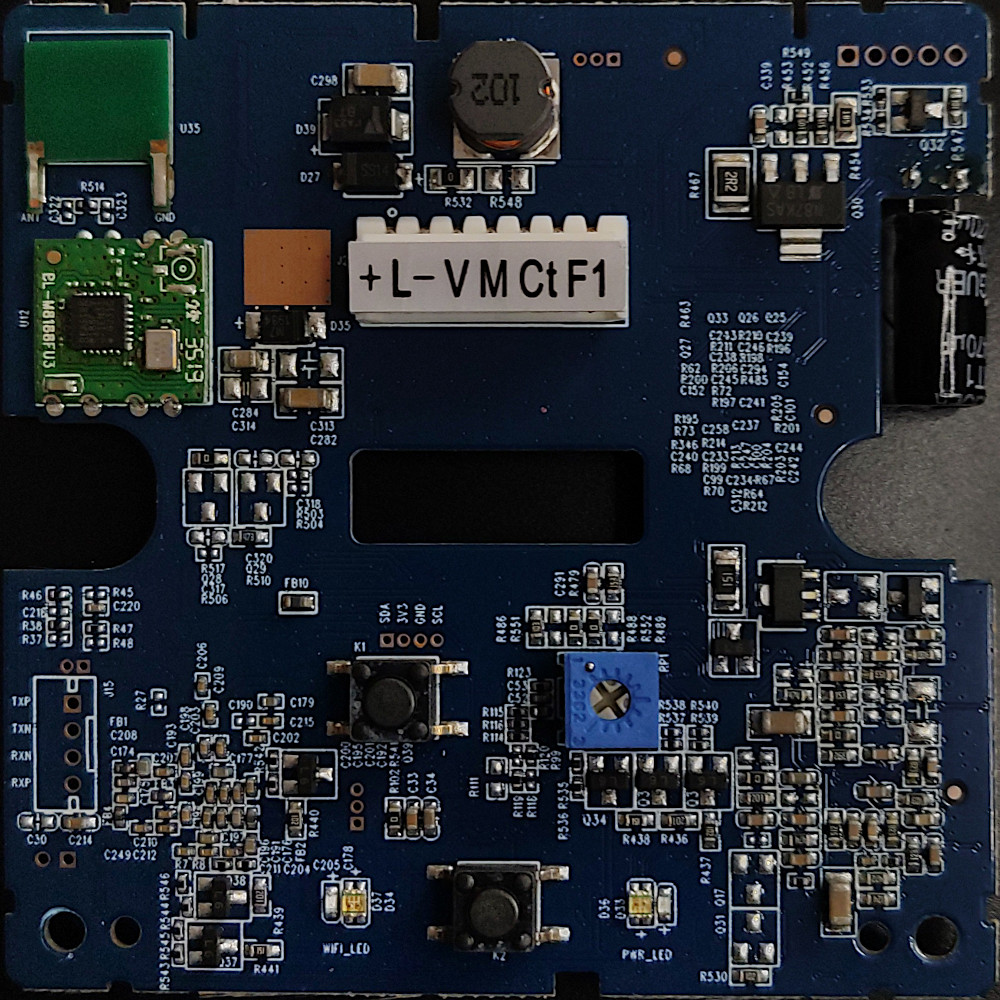
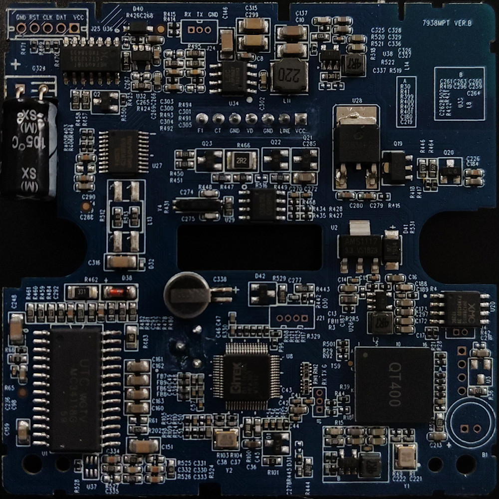

# WiBox Media

Custom firmware for the Fermax WiBox GK7102S intercom.

This project replaces the vendor cloud/web workflow with a local media runtime:

- answer and place intercom calls over SIP;
- send and receive audio over RTP/PCMA;
- send D1 H.264 video over RTP when the intercom has video support;
- open the door with DTMF `#`;
- expose the intercom to MQTT/Home Assistant.

The main runtime is `wibox-media-daemon`. It owns SIP signaling, RTP
audio/video, `/dev/ttySGK1` intercom serial events, DTMF, MQTT discovery/state
and door unlock logic.

Sofia, the original vendor app, is still used once at boot as a short hardware
warmup for the GK7102 video pipeline. It is not started per call.

## Credits

This project builds on earlier hard work from:

- [`duhow/wibox`](https://github.com/duhow/wibox), for the original WiBox
  firmware patching, installation and recovery groundwork.
- [`Conclusio/wibox-audio`](https://github.com/Conclusio/wibox-audio), for the
  tracing work and audio base that made the current audio integration possible
  and gave us the path to add video.


## Repository Layout

```text
src/sip_media/                  wibox-media-daemon source
src/d1_video_capture.c          standalone D1 H.264 capture proof
include/                        files copied into the generated /usr image
scripts/                        build, deploy, verify and flash tooling
docs/                           architecture, hardware and research docs
research/                       reverse-engineering notes and Sofia traces
mtd4                            factory /usr cramfs backup, local only
release/latest                  generated firmware image
```

## Supported Starting Point

This firmware is intended for Fermax WiBox GK7102S units.

You need a device firmware version:

```text
V500.R001.A103.00.G0021.B010 or older
```

If your unit runs a newer firmware, assume network shell access may be disabled
or incomplete. Use the serial recovery path instead of trying to flash over
WiFi/SSH.

## What You Need

On your computer:

- Linux shell.
- Docker.
- This repository.
- A factory `mtd4` backup saved as `./mtd4`.
- Goke SDK at:

```text
$HOME/config/GK710X_LinuxSDK_v2.0.0
```

On the WiBox:

- SSH or serial access as `root`.
- WiFi configured in `/mnt/mtd/wpa_supplicant.conf`.
- Serial recovery access prepared before first flash.

Safety notes:

- Unplug the WiBox before opening the case or attaching serial wires.
- Do not solder while the board is powered.
- Prepare serial recovery before first flash. A bad `/usr` image can stop WiFi
  from coming up.


## Fresh Device Journey

### 1. Check Firmware Version

Log into the WiBox if the current firmware allows it:

```text
user: root
pass: qv2008
```

Older Sofia console sessions may use:

```text
user: root
pass: aszeno
```

If the firmware is newer than `V500.R001.A103.00.G0021.B010`, skip WiFi/SSH
flashing and use serial recovery.

### 2. Prepare Serial Recovery

The serial console is `ttySGK2`, `115200`, no hardware flow control.

| WiBox board | USB TTL adapter |
|-------------|-----------------|
| GND         | GND             |
| TX          | RX              |
| RX          | TX              |




If nothing appears on serial during boot, enter U-Boot and set:

```sh
setenv consoledev 'ttySGK0'
saveenv
reset
```

### 3. Back Up the Factory Flash

At minimum, keep a copy of `mtd4`, the `/usr` cramfs partition. This repository
builds the custom image by extracting that partition and replacing selected
files.

If SSH is already available and this repo is on your computer:

```bash
make backup-mtd4
cp backups/mtd4-*.img ./mtd4
```

For a full manual backup from the device, start a receiver on your computer:

```bash
for i in $(seq 0 6); do
  nc -l -p 8888 > "mtd${i}"
done
```

Then run on the WiBox, replacing the IP:

```sh
PC_IP=192.168.1.100
for i in $(seq 0 6); do
  dd if=/dev/mtd${i} bs=4096 | nc "${PC_IP}" 8888
  sleep 1
done
```

The file needed by this project is `mtd4`.

### 4. Configure WiFi Persistence

Create `/mnt/mtd/wpa_supplicant.conf` on the WiBox:

```ini
ctrl_interface=/var/run/wpa_supplicant
ap_scan=1

network={
        ssid="YOUR_WIFI_NAME"
        psk="YOUR_WIFI_PASSWORD"
        scan_ssid=1
        key_mgmt=WPA-PSK
}
```

The generated firmware uses this file to bring WiFi back after boot.

### 5. Build the Firmware

Build the project Docker image:

```bash
make docker
```

This creates `wibox-build-tool:latest`. It contains the ARM toolchain,
PJProject, the SDK build environment and statically built `cramfsck/mkcramfs`
using Ubuntu 16.04 zlib 1.2.8.

Build the daemon and final `/usr` cramfs image:

```bash
make build
```

Output:

```text
release/image-YYMMDD-HHMM
release/latest -> image-YYMMDD-HHMM
```

### 6. Verify Before Flashing

If the current WiBox is reachable, first test the daemon from `/tmp` without
writing flash:

```bash
make deploy-runtime
make verify-device
```

Then verify the full local image:

```bash
make verify
```

`make verify` runs the host MQTT regression test, checks the generated image,
and validates the active WiBox daemon plus MQTT retained state.

### 7. Configure SIP, Video and MQTT

The runtime config lives on the WiBox:

```text
/mnt/mtd/sip_media.conf
```

If the file does not exist, first boot copies:

```text
/etc/sip_media.conf.default
```

Important settings:

```ini
outgoing_call_target=sip:1000@192.168.0.31:5060
outgoing_call_timeout=60
sip_port=5060
rtp_port=8000

video_enabled=1
video_rtp_port=8002
video_payload_type=96

serial_listener_enabled=1
intercom_device=/dev/ttySGK1

mqtt_enabled=1
mqtt_host=192.168.10.2
mqtt_user=mqtt
mqtt_pass=password
mqtt_homeassistant_prefix=homeassistant
```

Set `video_enabled=0` for intercom installations without video support.

Do not commit real MQTT credentials. Store them only on the device.

### 8. Flash Over SSH

Run the guarded dry run first:

```bash
make flash-dry-run
```

This builds the image, uploads or reuses `/tmp/update.img`, checks hashes and
stops before writing flash.

Create a verified backup of the current `/usr` partition:

```bash
make backup-mtd4
```

Flash:

```bash
make flash CONFIRM_FLASH=YES
reboot
```

`make flash` automatically runs `backup-mtd4` before writing. The flash script
confirms that `mtd4` is mounted as `/usr`, verifies the image hash, then calls
the bundled `/usr/bin/update_firmware.sh`.

## Runtime Behavior

Boot sequence:

```text
/usr/run.sh
  -> mount persistent config
  -> setup GPIO and LEDs
  -> start SSH
  -> load kernel modules
  -> bring up WiFi
  -> start cron and heartbeat
  -> run Sofia_temp.sh once for video hardware warmup
  -> create /mnt/mtd/sip_media.conf if missing
  -> start app_watchdog.sh wibox-media-daemon /usr/bin/wibox-media-daemon
  -> run /mnt/mtd/post.sh if executable
  -> set final LED state
```

`app_watchdog.sh` restarts the daemon if it exits and writes:

```text
/var/log/wibox-media-daemon.log
```

`/mnt/mtd/post.sh` is a local boot hook for site-specific extras. Keep it small
and do not start Sofia or another media runtime from it.

## Calling and Door Unlock

When the panel reports a ring on `/dev/ttySGK1`, `wibox-media-daemon` can place
an outgoing SIP call to `outgoing_call_target`.

When a SIP call is established:

- the daemon starts the intercom call path;
- direct GADI audio starts;
- D1 H.264 RTP video starts if negotiated and `video_enabled=1`;
- DTMF `#` opens the door.

DTMF over RTP telephone-event is supported, and SIP INFO is accepted as a
fallback.

## Home Assistant

The daemon publishes MQTT discovery and state directly. No `mosquitto_pub` or
`mosquitto_sub` binaries are needed.

Main entities:

```text
button.open_door
binary_sensor.ringing
binary_sensor.call_active
binary_sensor.sip_call_active
binary_sensor.video_active
sensor.media_state
sensor.last_ring
sensor.last_unlock
sensor.wifi_rssi
switch.video_enabled
```

The door command is high-level:

```text
wibox/<device>/door/open/set = PRESS
```

Home Assistant should not need to orchestrate `START_CALL`, unlock and
`STOP_CALL`; the daemon handles that sequence.

## LEDs

Current LED ownership remains in `run.sh`:

```text
red    booting or WiFi failure
off    WiFi setup in progress
green  WiFi associated and DHCP succeeded
blue   application boot finished
```

Runtime call-state LEDs are intentionally not implemented yet. If added later,
they should live in the daemon with an explicit priority model and physical
verification.

## Recovery

Use recovery methods in this order.

### 1. Recovery Over SSH

Use this if the device still boots and SSH works.

```bash
make flash-dry-run
make flash CONFIRM_FLASH=YES
reboot
```

To restore a previous backup, point `release/latest` or `IMAGE` to the backup
image before flashing, or manually upload it as `/tmp/update.img` and run the
device updater.

### 2. Recovery Via Shell

Use this if Linux boots but WiFi or normal startup is broken and you have serial
shell access.

On the WiBox:

```sh
cd /tmp
rx /tmp/update.img
```

From your terminal program, send `release/latest` with XMODEM/YMODEM support.
After transfer:

```sh
/usr/bin/update_firmware.sh
reboot
```

If `/usr/bin/update_firmware.sh` is not available, write `mtd4` manually only
as a last resort:

```sh
dd if=/tmp/update.img of=/dev/mtdblock4 bs=4096
sync
```

### 3. Recovery Via U-Boot

Use this when Linux does not boot far enough to get a shell.

From U-Boot:

```sh
mw.b 0xC1000000 ff 00b10000
sf probe
loady 0xC1000000
sf erase 0x00460000 00b10000
sf write 0xC1000000 0x00460000 00b10000
reset
```

Send `release/latest` via YMODEM when `loady` waits for the file.

## Research Notes

The current D1 video path is documented in:

- [`docs/d1_video_capture.md`](docs/d1_video_capture.md)
- [`docs/sip_media.md`](docs/sip_media.md)
- [`docs/architecture.md`](docs/architecture.md)

Reverse-engineering traces are kept under `research/`. They are not part of
the production runtime.
