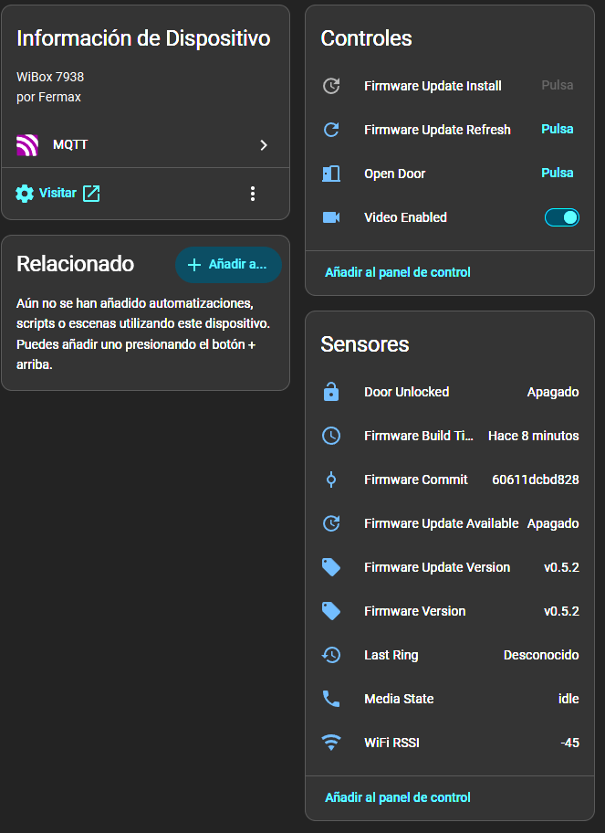

# Using Wibox patch

This firmware replaces the old web/script control path with
`wibox-media-daemon`, exposed primarily through SIP and MQTT/Home Assistant.

## MQTT / Home Assistant

MQTT/Home Assistant is handled directly by `wibox-media-daemon` using plain
MQTT on port 1883.



Configure MQTT in `/mnt/mtd/sip_media.conf`:

```bash
mqtt_enabled=1
mqtt_host=192.168.10.2
mqtt_user=mqtt
mqtt_pass=password
```

## Build and deploy

Build host tests, the daemon, and the cramfs image:

```bash
make test
make build
```

For a non-persistent runtime test, upload the daemon to `/tmp` and restart it:

```bash
make deploy-runtime
make verify
```

`deploy-runtime` verifies the active daemon checksum and MQTT/Home Assistant
state after restart. `verify` also runs host tests and checks `release/latest`.
To verify MQTT manually:

```bash
MQTT_HOST=192.168.10.2 MQTT_USER=mqtt MQTT_PASS=password make verify-mqtt
```

To persist the image to `/usr` (`mtd4`), use the guarded flash target:

```bash
make flash-dry-run
make backup-mtd4
make flash CONFIRM_FLASH=YES
```

`flash-dry-run` verifies or uploads `/tmp/update.img` and stops before writing
mtd4. `flash` runs `backup-mtd4` automatically before writing.

## Keep application working

If you want to keep using Sofia original application,
you can tweak `post-run` script in order to boot it.

Beware that enabling Sofia will disable this patched application to work,
so controls will only work with original Wibox application.

Create file `/mnt/mtd/factory` (`touch`) to disable patch boot.

You can also update or create `/mnt/mtd/post.sh` with **executable permissions** and write:

```bash
#!/bin/sh

# run factory program
/usr/run-orig.sh
```
