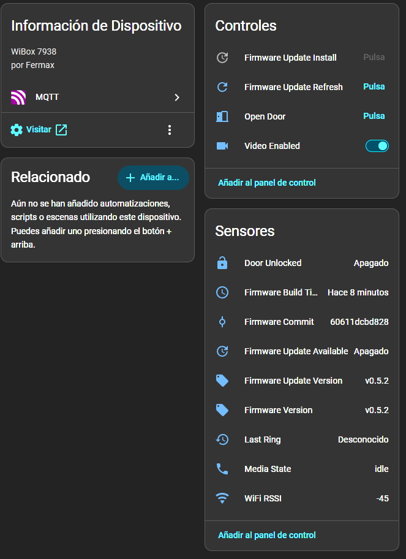

# Runtime

`wibox-media-daemon` is the SIP, media, intercom, MQTT and update runtime.

## Configuration

Persistent config:

```text
/mnt/mtd/sip_media.conf
```

Default config in the image:

```text
/usr/etc/sip_media.conf.default
```

Key options:

```ini
sip_outgoing_call_enabled=1
outgoing_call_target=sip:1000@192.168.0.31:5060
outgoing_call_timeout=60
sip_port=5060
rtp_port=8000

video_enabled=0
video_rtp_port=8002
video_payload_type=96
video_bitrate_kbps=4096
video_gop_n=25
video_idr_interval=1
video_brc_mode=0
video_rtsp_periodic_idr_ms=0
video_recording_enabled=0
video_recording_path=/tmp/wibox-last-call.h264
video_recording_max_seconds=30
rtsp_enabled=0
rtsp_port=8554
rtsp_auth_user=
rtsp_auth_pass=
ring_snapshot_delay_ms=2000

serial_listener_enabled=1
intercom_device=/dev/ttySGK1

mqtt_enabled=1
mqtt_host=127.0.0.1
mqtt_user=
mqtt_pass=
mqtt_homeassistant_prefix=homeassistant
mqtt_base_topic=
mqtt_device_id=
mqtt_device_name=

firmware_update_enabled=1
firmware_update_repo=segator/wibox-media

prometheus_enabled=1
prometheus_port=9617

audio_buffer_size=160
audio_chip_gpio=18
audio_input_gain_percent=35
audio_output_volume_percent=50
audio_line_mute_ms=900
```

Leave `mqtt_base_topic`, `mqtt_device_id` and `mqtt_device_name` empty unless
you need stable custom names. The daemon derives them from the WiBox hostname.

## SIP And Media

Doorbell presses always publish `media/state = ringing`. When
`sip_outgoing_call_enabled=1`, the daemon also sends an outgoing SIP INVITE to
`outgoing_call_target`. When it is `0`, the daemon skips the automatic SIP call
so Home Assistant automations can notify first and a user can call back into the
WiBox manually. `outgoing_call_timeout` is the generic ring/call-attempt
timeout: it returns `media/state` from `ringing` to `idle` if no SIP call is
active when the timeout expires.

The daemon advertises:

```text
audio: PCMA/8000
video: H.264/90000, payload type 96 by default
DTMF:  telephone-event/8000
```

When a SIP call is established, the daemon sends `START_CALL` to the intercom
MCU and starts direct GADI audio. `video_enabled` is the global video capability
flag: when it is `0`, no video is advertised or captured anywhere. When it is
`1`, SIP advertises H.264 and starts the D1 video worker if video was
negotiated. The factory default is `video_enabled=0`, so fresh installations
start audio-only until video is enabled from Home Assistant, retained MQTT, or
`/mnt/mtd/sip_media.conf`.

On hangup or failure, it stops media and sends `STOP_CALL` when needed.

## Audio Tuning

The daemon uses direct GADI audio with PCMA/A-law at 8 kHz. The default audio
path is tuned for the Fermax WiBox analog panel, where short street noises can
otherwise be amplified into loud pops:

| Key | Default | Notes |
|-----|---------|-------|
| `audio_input_gain_percent` | `35` | Microphone capture gain. Lower values reduce clipping and loud transient pops from the outside panel. |
| `audio_output_volume_percent` | `50` | Speaker/output volume sent to the intercom audio path. |
| `audio_line_mute_ms` | `900` | Short input mute applied when the intercom line is opened or closed. This masks hardware start/stop transients while RTP timing stays continuous. Values above `3000` ms are clamped. |

The low-level echo/noise processing is aligned with the original Sofia audio
path, but automatic gain control is disabled. Keeping gain fixed avoids boosting
sudden street noises into exaggerated pops.

`video_bitrate_kbps` controls the target bitrate programmed into the D1 H.264
encoder. The runtime default is `4096`; values are clamped between `512` and
`4096` kbps. Higher values can reduce macroblocking, but low light, analog CVBS
noise and client-side decode limits still affect quality.

Advanced H.264 encoder knobs:

| Key | Default | Notes |
|-----|---------|-------|
| `video_gop_n` | `25` | Main stream GOP length. At 25 fps this gives roughly one natural IDR per second. |
| `video_idr_interval` | `1` | IDR interval inside the GK H.264 config. Keep `1` unless testing carefully. |
| `video_brc_mode` | `0` | Bitrate-control mode passed to the GK encoder. `0` is the stable default; `1` has been tested but can exceed the requested bitrate. |
| `video_rtsp_periodic_idr_ms` | `0` | Extra periodic IDR requests for RTSP. `0` disables them; new RTSP/SIP clients still request one IDR on attach. |

The default GOP/IDR policy is intentionally conservative: use the encoder's
natural GOP (`video_gop_n=25`) and request IDR frames only when a new client
attaches or startup needs one. This avoids spending bitrate on unnecessary RTSP
keyframes every few seconds. Re-enable periodic RTSP IDR only if a downstream
consumer cannot recover after packet loss.

## Video Recording

Recording to file is intentionally disabled by default:

```ini
video_recording_enabled=0
video_recording_path=/tmp/wibox-last-call.h264
video_recording_max_seconds=30
```

At `4096` kbps, 30 seconds is about 15 MiB. That only fits in `/tmp` with little
headroom and must never be written to `/mnt/mtd` or other flash-backed storage.

## Experimental RTSP Stream

The daemon can expose an RTSP/TCP interleaved stream for go2rtc, Frigate or VLC:

```ini
rtsp_enabled=1
rtsp_port=8554
rtsp_auth_user=
rtsp_auth_pass=
```

URL:

```text
rtsp://<wibox-ip>:8554/live
```

Tracks:

```text
video: H264/90000, payload 96
audio: PCMA/8000, payload 8
```

`rtsp_enabled` controls only whether the RTSP service listens. `video_enabled`
still controls whether RTSP advertises and captures video. With
`video_enabled=0`, RTSP remains valid but advertises only the PCMA audio track.
With both `rtsp_enabled=1` and `video_enabled=1`, RTSP advertises H.264 video
and PCMA audio.

The RTSP server accepts clients while idle. When a video client is connected and
global video is enabled, the daemon starts the same D1 H.264 worker used for
SIP video and tees its RTP packets into RTSP. With no active panel call, the
video frames may be blue/static; the stream becomes real panel video when the
outside panel opens its video path during a ring or `START_CALL`.

There is only one video worker. RTSP "preview" means that this worker is running
without a SIP RTP target. During an established SIP call, the daemon attaches
the SIP RTP target to the existing worker with a control command. When the call
ends, the SIP RTP target is cleared; if an RTSP client is still connected, the
worker keeps running and RTSP continues without an encoder restart. The worker
is stopped only when no SIP target is attached and no RTSP video clients remain.

Audio is not owned by the video worker. RTSP clients that negotiated the audio
track start the shared audio engine and receive PCMA RTP packets. During an
established SIP call, the daemon attaches the SIP audio RTP target to that same
engine. When the call ends, only the SIP RTP target is cleared if RTSP clients
are still connected; audio stops after the last RTSP client disconnects and no
SIP target remains.

Optional RTSP Basic authentication is enabled by setting `rtsp_auth_user` or
`rtsp_auth_pass`. Clients then use:

```text
rtsp://<user>:<password>@<wibox-ip>:8554/live
```

RTSP Basic auth is plaintext on the LAN. It prevents accidental unauthenticated
clients; it is not a replacement for network-level isolation.

## Network Endpoints

The custom image exposes small LAN services intended for a trusted home network:

| Endpoint | Default | Auth | Purpose |
|----------|---------|------|---------|
| SSH | TCP 22 | Dropbear password/key auth | administration and recovery |
| SIP | UDP 5060 | none | call signaling |
| RTP audio | UDP 8000 | none | PCMA media for SIP |
| RTP video | UDP 8002 | none | H.264 media for SIP when `video_enabled=1` |
| RTSP | TCP 8554 | optional Basic auth | Frigate/go2rtc/VLC stream when `rtsp_enabled=1` |
| Prometheus | TCP 9617 | none | `/metrics` and `/healthz` |
| MQTT | outbound TCP 1883 | broker credentials | Home Assistant integration |

Do not expose SIP/RTP, RTSP or Prometheus directly to the internet. Keep them on
the LAN/VPN, or restrict them with the router/firewall. RTSP Basic auth is useful
for accidental LAN access, but it is not encrypted.

## Intercom Serial

Device:

```text
/dev/ttySGK1
```

Important commands:

```text
START_CALL   FB 14 01 20
STOP_CALL    FB 14 00 1F
OPEN_DOOR    FB 12 01 1E
```

Important incoming frames:

```text
ALARM_REPORT  FB 11 00 1C
PUSH_STATE_0  FB 19 00 24  (call forwarding off)
PUSH_STATE_1  FB 19 01 25  (call forwarding on)
HANG_UP       FB 13 00 1E / FB 13 01 1F
STOP_RING     FB 23 00 2E
```

The daemon logs every raw serial read and publishes UART observability over
MQTT without changing the media state model. `media/state` remains limited to
`idle`, `ringing` and `established`; low-level panel events are exposed as
separate event telemetry.

MQTT topics:

```text
wibox/<hostname>/uart/event  stateless JSON event, not retained
```

Home Assistant discovery adds:

```text
event.wibox_uart_event       stateless UART event entity
```

Example payload:

```json
{
  "event_type": "physical_handset_answered",
  "alias": "PHYSICAL_HANDSET_ANSWERED",
  "raw": "FB 23 00 2E",
  "direction": "in",
  "param": 0,
  "known": true,
  "ts": 1783274400
}
```

Commands sent by the daemon are published on the same topics with
`direction: "out"`, for example `START_CALL`, `STOP_CALL`, `UNLOCK_DOOR` and
`ENABLE_PUSH_STATE`.

The daemon deliberately does not reproduce the Sofia `FB 10 xx` traffic:

```text
FB 10 00 1B
FB 10 04 1F
FB 10 5E 79
```

Reverse engineering shows that Sofia registers its UART receiver and schedules
a `SysUpToMcu` callback every 2000 ms. That callback sends an `FB 10 <state>`
frame whose state byte is mutable. Its practical purpose is not proven and the
current product flow does not need it, so sending one-shot probes or a periodic
heartbeat would add hardware risk without a demonstrated benefit. See
`research/SOFIA_HARDWARE_INTERACTIONS.md`.

Real outside-panel calls must arrive as `ALARM_REPORT`. If pressing the physical
WiBox forward button only produces `PUSH_STATE_0` / `PUSH_STATE_1`, that only
proves the call-forward button is being read. It does not prove the WiBox is
paired to the VDS address. See [Getting Started](getting_started.md#10-doorbell-call-troubleshooting).

See [UART Codes](codes.md) for the full list.

## Home Assistant / MQTT

The daemon publishes Home Assistant discovery using MQTT retained config
messages.



Default base topic:

```text
wibox/<hostname>
```

Commands:

```text
wibox/<hostname>/door/open/set = PRESS
wibox/<hostname>/f1/trigger/set = PRESS
wibox/<hostname>/developer/mode/set = ON|OFF
wibox/<hostname>/developer/simulate_ding/set = PRESS
wibox/<hostname>/snapshot/take/set = PRESS
wibox/<hostname>/snapshot/ring_delay_ms/set = 0..5000
wibox/<hostname>/video/enabled/set = ON|OFF
wibox/<hostname>/rtsp/enabled/set = ON|OFF
wibox/<hostname>/video/bitrate_kbps/set = 512..4096
wibox/<hostname>/call/timeout_seconds/set = 10..120
wibox/<hostname>/call_forward/enabled/set = ON|OFF
wibox/<hostname>/firmware/update/check/set = PRESS
wibox/<hostname>/firmware/update/install/set = PRESS
```

State topics:

```text
wibox/<hostname>/media/state
wibox/<hostname>/door/unlocked
wibox/<hostname>/snapshot/image
wibox/<hostname>/snapshot/take/availability
wibox/<hostname>/snapshot/ring_delay_ms
wibox/<hostname>/video/enabled
wibox/<hostname>/rtsp/enabled
wibox/<hostname>/video/bitrate_kbps
wibox/<hostname>/call/timeout_seconds
wibox/<hostname>/call_forward/enabled
wibox/<hostname>/wifi/rssi
wibox/<hostname>/firmware/version
wibox/<hostname>/firmware/commit
wibox/<hostname>/firmware/build_timestamp
wibox/<hostname>/firmware/update/available
wibox/<hostname>/firmware/update/version
wibox/<hostname>/firmware/update/install/availability
```

`media/state` values:

```text
idle
ringing
established
```

`door/unlocked` is a short pulse: `ON` then `OFF`.

`snapshot/take/set` captures one JPEG frame and publishes it to the MQTT Image
entity at `snapshot/image`. The image payload is base64-encoded JPEG
(`image_encoding=b64`) so Home Assistant can display the latest doorphone
snapshot directly. `snapshot/take/availability` is `offline` while a capture is
running or while `video_enabled=0`, so Home Assistant disables the
`Take Snapshot` button until the worker completes or video is enabled.

Snapshots require `video_enabled=1`. When no video worker is active, snapshots
use the standalone MJPEG path on
`stream_id=0` and capture D1 `688x576`. When RTSP/go2rtc or SIP video is already
active, the daemon keeps the `stream_id=0` H.264 D1 worker running and asks that
same worker to start `stream_id=2` MJPEG at `352x288` for the snapshot. This
avoids a second `/dev/gk_video` owner and keeps the RTSP/SIP video stream alive.
Small initial JPEG frames are discarded so the published snapshot is taken after
the panel video has settled.

Real outside-panel rings (`ALARM_REPORT`) also trigger an automatic snapshot.
The daemon waits for `Ring Snapshot Delay` (`snapshot/ring_delay_ms`, default
`2000`, range `0..5000 ms`, step `500 ms`), then captures without sending
`START_CALL` or `STOP_CALL`; the physical panel has already opened the video
path for that ring. Manual snapshots still open a temporary panel context
because cold captures without it produce a blue frame.

The `Video Enabled`, `RTSP Enabled`, `Video Bitrate`, `Outgoing Call Timeout`
and `Ring Snapshot Delay` entities are runtime configuration overrides. Without
retained MQTT commands or file overrides, the built-in defaults are
`video_enabled=0`, `rtsp_enabled=0`, `video_bitrate_kbps=4096`,
`outgoing_call_timeout=60` and `ring_snapshot_delay_ms=2000`. The boot default
still comes from
`/mnt/mtd/sip_media.conf` when a key is present, but Home Assistant publishes
these command topics as retained MQTT messages, so the last selected value is
replayed after a daemon or WiBox reboot and takes priority over the file value.
The daemon republishes the accepted/clamped state separately.

Retained MQTT messages are only accepted for configuration topics. Retained
button/action topics such as `door/open/set`, `snapshot/take/set`,
`firmware/update/check/set` and `firmware/update/install/set` are ignored so a
broker reconnect or daemon restart cannot replay a door unlock, snapshot or
firmware update.

Video resolution is not exposed over MQTT because only D1 `688x576` is currently
validated. If more modes are added, they should be exposed as a closed MQTT
select, never as a free-form text or number input.

`f1/trigger/set` sends a short F1 auxiliary-function pulse. On Fermax systems
this is not the main door opener; it is intended for installations wired with an
additional F1 relay, for example an auxiliary door, lights or lift control.

`developer/simulate_ding/set` writes the configured `ding_message` to
`/tmp/pipe_sip`, equivalent to `echo DING > /tmp/pipe_sip`. It does not
duplicate the doorbell logic in the MQTT handler; it triggers the existing local
control-pipe path. The command only runs while `developer/mode` is `ON`; when
developer mode is `OFF`, Home Assistant marks the button unavailable and direct
MQTT commands are ignored. Retained messages on both developer topics are
ignored, and developer mode defaults to `OFF` after daemon restart.

`call_forward/enabled` controls the physical Fermax call-forward/redirect state.
`ON` sends `FB 19 01 25` and should leave the WiBox LED blue. `OFF` sends
`FB 19 00 24` and should leave it green. The same state is updated when the
physical WiBox forward button reports `PUSH_STATE_0` / `PUSH_STATE_1`.

The update install button is only available when an update is available. It is
set unavailable immediately after an install request is accepted.

## Prometheus

If `prometheus_enabled=1`, scrape:

```text
http://<wibox-ip>:9617/metrics
```

Health endpoint:

```text
http://<wibox-ip>:9617/healthz
```

Current metric families:

```text
wibox_info
wibox_uptime_seconds
wibox_health
wibox_mqtt_connected
wibox_call_active
wibox_sip_call_active
wibox_video_active
wibox_video_enabled
wibox_ringing
wibox_rings_total
wibox_calls_started_total
wibox_video_sessions_started_total
wibox_door_unlocks_total
wibox_last_ring_timestamp_seconds
wibox_last_unlock_timestamp_seconds
wibox_wifi_rssi_dbm
wibox_uart_frames_total
wibox_uart_unknown_frames_total
wibox_uart_alarm_reports_total
wibox_uart_hangups_total
wibox_uart_stop_rings_total
wibox_uart_resets_total
wibox_uart_push_state_total
wibox_uart_f1_total
```

Some Prometheus gauges expose lower-level runtime state for monitoring even
though Home Assistant intentionally presents only the simpler `media_state`.

The runtime log is `/var/log/wibox-media-daemon.log`. In the production image
`app_watchdog.sh` rotates it to `/var/log/wibox-media-daemon.log.old` at 100 KB.
`/var` is RAM-backed on the WiBox, so this protects RAM usage and does not write
logs to flash.

## Local Test API

The daemon creates a FIFO:

```text
/tmp/pipe_sip
```

Examples:

```sh
echo DING > /tmp/pipe_sip
echo 'UART FB 11 00 1C' > /tmp/pipe_sip
echo 'UART FB 19 00 24' > /tmp/pipe_sip
echo 'AUDIO_TEST 192.168.0.183 4012 5' > /tmp/pipe_sip
echo 'VIDEO_TEST 192.168.0.183 4014 5' > /tmp/pipe_sip
```

`DING` simulates a doorbell from the local control pipe. It triggers the same
outgoing SIP call flow as a panel ring and also starts the automatic ring
snapshot with a temporary panel context, because no physical panel press exists
to open the analog video path for the simulated event.

`UART ...` injects a four-byte serial frame into the same handler used by
`/dev/ttySGK1`. For example, `UART FB 11 00 1C` follows the exact
`ALARM_REPORT` software path used by a real panel ring; that path assumes the
physical panel has already opened the video path.

`AUDIO_TEST` and `VIDEO_TEST` are bounded diagnostics. They start the panel call
context, run media to the supplied IP/port for the requested number of seconds,
then stop the panel context.

## Logs

Runtime log:

```text
/var/log/wibox-media-daemon.log
```

Firmware update log:

```text
/tmp/firmware_update.log
```

Both are RAM-backed and reset on reboot.
